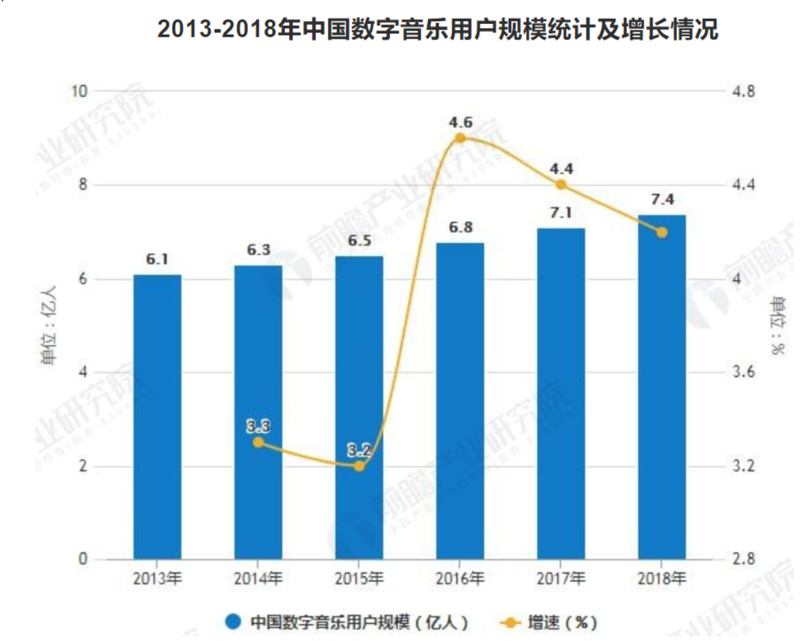
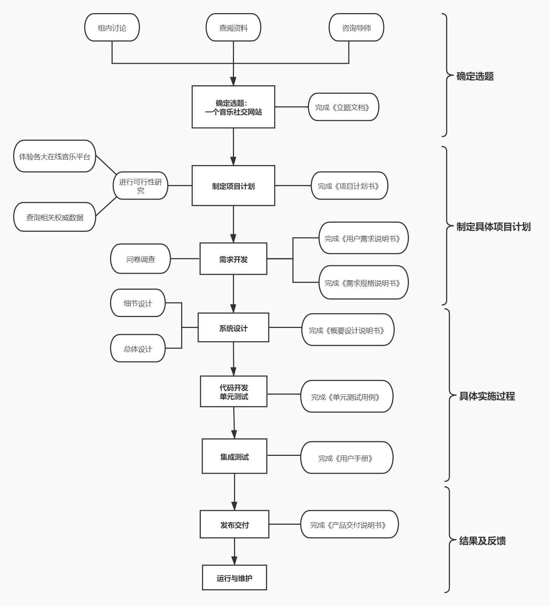

#  一个音乐社交网站

[TOC]

## 背景描述与市场需求

​       上图为前瞻产业研究院整理发布中国近年来数字音乐用户规模，可以见得，随着生活水平的提高，越来越多的人喜欢倾听音乐。

​     近年来，随着网络技术的发展，音乐产业进入互联网时代，网络逐渐成为人们随时随地收听音乐的媒介，而集成了在线收听、分享互动等丰富功能于 一身的在线音乐平台，正逐渐成为人们获取、了解音乐的主要方式。

​     有研究分析表明，社交化已经成为在线音乐平台最显著的发展趋势。社交化除了可以提高用户粘性，增加音乐内容的分发量之外，其核心价值在于通过用户在使用网站中形成“关系”。

​     在线音乐平台的“社交化”体验逐渐成为人们的需求，社交功能不仅推动了信息生产者的多样化和去权威化，也很好地缓解了用户的孤独感和疏离感，让更多的人参与进音乐的欣赏和分享。

## 预期功能

**主要功能为：社交、分享音乐、分享心情**

* 在网站内用户可以通过发表音乐、图片，同时在图片上输入一段自主输入的描述歌曲或是心情的文字来分享音乐，同时分享心情。

* 上述方式在站内是固定方式，具体为:
  * 图片经过暗化处理，文字会附在图片上面，可以清晰用文字表达心情的同时通过图片、音乐凸显个人品味。
  * 文字字数有一定的规定，不可超过规定字数。

* 网站设有广场和好友圈，广场内容所有用户可见，好友圈内容仅好友可见。

* 发表的内容可选择分别或共同推送到广场或好友圈，各用户可以发现相同的音乐偏好，以达到社交的功能。

* 支持添加好友功能，可以支持相同音乐偏好的用户相互添加成为好友，进行更深层次的交流。

## 预期的技术路线

* **研究的总体思路：**
  * 组内讨论，查阅资料，咨询导师，最终确定选题 —— 一个音乐社交网站，完成《立题文档》。
  * 制定项目计划，对选题进行可行性研究，体验各大音乐在线平台，查询相关权威数据，完成《项目计划书》。
  * 需求开发阶段，必要时进行问卷调查，完成《用户需求说明书》、《需求规格说明书》。
  * 系统设计阶段，分为总体设计和细节设计，利用Axure原型设计工具完成网页原型设计，利用Visio、ProcessOn制图工具制作各类所需流程图，此阶段需完成《概要设计说明书》。
  * 使用Django框架完成代码开发，并在开发过程中进行单元测试，完成《单元测试用例》。
  * 集成测试，并完成《用户手册》。
  * 发布交付，完成《产品交付说明书》。
  * 运行与维护，随时解决用户发现的新问题，完善网页。

* **技术路线图 ：**

  

## 选题亮点

* 随着互联网的发展，现在有越来越多的社交网站问世，音乐软件也接连推广，但大多软件功能都较为单一，社交软件具有单一的社交功能，音乐软件则侧重于音乐推广，而我们的网站则将两者结合，分享音乐、分享心情，同时具有社交功能。

* 平时在朋友圈、微博等社交平台我们分享的是生活、兴趣，也有音乐，但内容较为复杂。而在我们的音乐社交网站，是一个纯纯的分享音乐内容的网站，为广大的音乐爱好者们提供一个纯净的平台，让用户“听见好时光”。

## 目标人群

* 在生活中，他们：
  * 个性张扬
  * 热爱音乐
  * 渴望了解新事物
  * 爱好交友，特别是兴趣相投的人
  * 想释放工作、学习压力的上班族、学生族

* 在互联网上，他们：
  * 追求个性化表现
  * 乐于尝试新兴事物
  * 渴望自我表达
  * 希望得到认可

## 预期市场目标

* 能够达到预期功能，用户能够在网站内进行音乐交流、音乐分享，同时进行心情分享和社交。

* 通过各类推广手段完成网站的既定的网站访问量及注册用户数量指标。

  