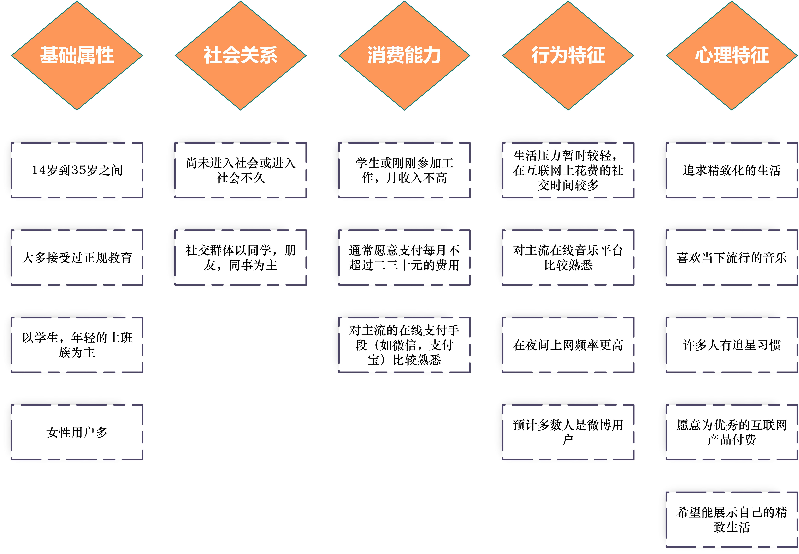

 <h1> 需求文档 </h1> 

[TOC]

## 一、大纲

### 1.1 目的

本文档旨在明确“诗音日记”音乐分享网站所具备的功能与性能，为本网站的设计和编程提供基础，为测试和验收提供依据。本文档主要读者范围为产品设计人员、前后端开发人员、UI设计人员、测试人员。

### 1.2 项目背景

本软件的正式名称为“诗音日记”音乐分享网站，在本文档中仅简称为“网站”。本项目的设计，分析，实现人员为我小组的成员。

 

近年来中国的数字音乐用户规模

由图可以见得，网络是人们随时随地收听音乐的媒介，而集成了在线收听、分享互动等丰富功能于一身的在线音乐平台，正逐渐成为人们获取、了解音乐的主要方式。

而有研究分析表明，社交化已经成为在线音乐平台最显著的发展趋势。社交化除了可以提高用户粘性，增加音乐内容的分发量之外，其核心价值在于通过用户在使用网站中形成“关系”。在线音乐平台的“社交化”体验逐渐成为人们的需求，社交功能不仅推动了信息生产者的多样化和去权威化，也很好地缓解了用户的孤独感和疏离感，让更多的人参与进音乐的欣赏和分享。

当前的在线音乐平台的主要业务是在线的音乐试听，辅以电台、直播、分享等功能。在行业巨头把持着大量音乐版权的现在，使用“自主截取分享+音乐外链”的方式，能够有效避免版权纠纷，达到社交功能。

### 1.3 术语说明

本软件的开发环境为django WEB框架， SQLite数据库和HTML5前端页面。

软件开发过程中使用git进行版本控制以及团队合作，代码的托管平台为github.

## 项目概述

### 2.1 一般概述

“诗音日记”音乐分享网站以音乐分享为基本功能，计划用户能够在网站内进行音乐交流、音乐分享，同时进行心情分享和其他社交活动。软件应该有良好的用户交互界面，完善的业务逻辑实现和高效的数据处理能力，以满足用户的各项网站使用需求，提升用户使用体验。

### 2.2 待开发主要功能

本软件的基本业务流程如下：

 

基本业务流程

**在建立基本业务流程框架的基础上，列出以下的主要功能：**

#### 2.2.1 用户功能简述

* 注册
* 登录
* 编辑个人资料
* 修改密码
* 关注其他用户
* 与好友聊天
* 创建，进入群组

#### 2.2.2 动态功能简述

* 上传/选择音乐
* 上传图片
* 编辑文字

#### 2.2.3 时间线功能简述

* 生成朋友圈
* 生成广场
* 生成热门推荐

### 2.3 用户特征

本产品的目标用户主要包括**学生**和**有活跃社交需求的年轻上班族**。对他们的特征分析，可见于基础属性，社会关系，消费能力，行为特征和心理特征等五个方面。

 

用户特征分析

### 2.4 运行环境

本软件的测试环境为Windows10 1803操作系统上的chrome浏览器（版本 80.0.3987.149）。

## 功能需求

### 3.1 功能划分

|    功能名    |             功能简述             | 优先级 |
| :----------: | :------------------------------: | :----: |
|     注册     |             用户注册             |   P2   |
|     登录     |             用户登录             |   P1   |
| 编辑个人资料 |         用户完善个人信息         |   P3   |
|   修改密码   |             修改密码             |   P1   |
|     关注     |   关注其他用户，互关则成为好友   |   P2   |
|   取消关注   |          取关已关注用户          |   P3   |
|     聊天     |         用户之间直接聊天         |   P1   |
|     群聊     |       创建，加入，参与群聊       |   P2   |
|     收藏     | 用户对动态进行收藏，便于之后查看 |   P3   |
|   发布动态   | 发布音乐动态，包括音乐图片和文字 |   P1   |
|  生成朋友圈  |         推送关注列表动态         |   P2   |
|   生成广场   |         推送全部用户动态         |   P3   |
| 生成热门推荐 |        推送当前的热门动态        |   P2   |

### 3.2 功能描述

对各个功能进行诨细的描述。

<table>
    <tbody align="center">
    <tr>
        <td>功能名称</td>
        <td colspan="2">注册</td>
    </tr>
    <tr>
        <td>角色</td>
        <td colspan="2">未注册用户</td>
    </tr>
    <tr>
        <td>功能描述</td>
        <td colspan="2">未注册用户新建一个账户</td>
    </tr>
    <tr>
        <td>优先级</td>
        <td colspan="2">P2</td>
    </tr>
    <tr>
        <td>前置条件</td>
        <td colspan="2">用户尚未注册</td>
    </tr>
    <tr>
        <td rowspan="5">基本流程</td>
        <td>用户</td>
        <td>系统</td>
    </tr>
    <tr>
        <td>用户填写注册信息</td>
        <td></td>
    </tr>
    <tr>
        <td></td>
        <td>检查用户信息是否合法</td>
    </tr>
    <tr>
        <td>用户点击注册按钮，提交信息</td>
        <td></td>
    </tr>
    <tr>
        <td></td>
        <td>系统根据提交的信息创建用户</td>
    </tr>
    <tr>
        <td rowspan="2">备选流程</td>
        <td colspan="2">如果用户填写的信息不合法，则注册按键不可用，并提示用户正确的信息填写方式</td>
    </tr>
    <tr>
        <td colspan="2">如果后台未能成功创建用户，则返回错误信息，提示用户重新注册并跳转</td>
    </tr>
    <tr>
        <td>业务规则</td>
        <td colspan="2">用户输入的用户名不能重复，两次输入密码应保持一致</td>
    </tr>
    </tbody>
</table>

<table>
    <tbody align="center">
    <tr>
        <td>功能名称</td>
        <td colspan="2">登录</td>
    </tr>
    <tr>
        <td>角色</td>
        <td colspan="2">已注册用户</td>
    </tr>
    <tr>
        <td>功能描述</td>
        <td colspan="2">已注册用户进行登录操作</td>
    </tr>
    <tr>
        <td>  优先级  </td>
        <td colspan="2">P1</td>
    </tr>
    <tr>
        <td>前置条件</td>
        <td colspan="2">用户已经注册</td>
    </tr>
    <tr>
        <td rowspan="5">基本流程</td>
        <td>用户</td>
        <td>系统</td>
    </tr>
    <tr>
        <td>用户填写登录信息</td>
        <td></td>
    </tr>
    <tr>
        <td></td>
        <td>检查用户输入的信息是否合法</td>
    </tr>
    <tr>
        <td>用户点击登录按钮，提交信息</td>
        <td></td>
    </tr>
    <tr>
        <td></td>
        <td>在数据库中检索用户信息。若能成功匹配，则返回登录成功信息</td>
    </tr>
    <tr>
        <td rowspan="2">备选流程</td>
        <td colspan="2">如果用户填写的信息不合法，则登录按键不可用，并提示用户正确的信息填写方式</td>
    </tr>
    <tr>
        <td colspan="2">如果数据库未能查找到相应的用户信息，则返回错误信息（用户名不存在或密码错误），提示用户重新登录并跳转到登录初始页面</td>
    </tr>
    <tr>
        <td>业务规则</td>
        <td colspan="2">用户输入的登录信息应合法，密码不应小于六位的最低长度限制</td>
    </tr>
    </tbody>
</table>

<table>
    <tbody align="center">
    <tr>
        <td>功能名称</td>
        <td colspan="2">编辑个人资料</td>
    </tr>
    <tr>
        <td>角色</td>
        <td colspan="2">已注册用户</td>
    </tr>
    <tr>
        <td>功能描述</td>
        <td colspan="2">允许已注册的用户修改，添加自己的个人资料</td>
    </tr>
    <tr>
        <td>优先级</td>
        <td colspan="2">P3</td>
    </tr>
    <tr>
        <td>前置条件</td>
        <td colspan="2">用户已经注册</td>
    </tr>
    <tr>
        <td rowspan="6">基本流程</td>
        <td>用户</td>
        <td>系统</td>
    </tr>
    <tr>
        <td>用户进入修改信息页面</td>
        <td></td>
    </tr>
    <tr>
        <td>用户填写个人信息</td>
        <td></td>
    </tr>
    <tr>
        <td></td>
        <td>实时检测用户输入合法性</td>
    </tr>
    <tr>
        <td>用户点击保存</td>
        <td></td>
    </tr>
    <tr>
        <td></td>
        <td>在数据库中录入用户的新信息</td>
    </tr>
    <tr>
        <td rowspan="2">备选流程</td>
        <td colspan="2">如果用户填写的信息不合法，则保存信息按键不可用，并提示用户正确的信息填写方式</td>
    </tr>
    <tr>
        <td colspan="2">如果数据库更新个人资料识别，则返回错误信息（用户名不存在或密码错误），提示用户并重新进入个人信息编辑页面</td>
    </tr>
    <tr>
        <td>业务规则</td>
        <td colspan="2">用户输入的登录信息应合法</td>
    </tr>
    </tbody>
</table>

<table>
    <tbody align="center">
    <tr>
        <td>功能名称</td>
        <td colspan="2">修改密码</td>
    </tr>
    <tr>
        <td>角色</td>
        <td colspan="2">已注册用户</td>
    </tr>
    <tr>
        <td>功能描述</td>
        <td colspan="2">已注册用户修改密码</td>
    </tr>
    <tr>
        <td>优先级</td>
        <td colspan="2">P1</td>
    </tr>
    <tr>
        <td>前置条件</td>
        <td colspan="2">用户已经注册</td>
    </tr>
    <tr>
        <td rowspan="4">基本流程</td>
        <td>用户</td>
        <td>系统</td>
    </tr>
    <tr>
        <td>用户填写旧密码，两次填写新密码</td>
        <td></td>
    </tr>
    <tr>
        <td>用户点击确认修改按钮，提交信息</td>
        <td></td>
    </tr>
    <tr>
        <td></td>
        <td>在数据库中检索用户信息。若能成功匹配旧密码，则将密码修改为新密码</td>
    </tr>
    <tr>
        <td rowspan="1">备选流程</td>
        <td colspan="2">如果用户填写的旧密码不正确，则返回密码修改失败信息，重新进入密码修改界面</td>
    </tr>
    <tr>
        <td>业务规则</td>
        <td colspan="2">用户输入的新密码应合法，密码不应小于六位的最低长度限制</td>
    </tr>
    </tbody>
</table>

<table>
    <tbody align="center">
    <tr>
        <td>功能名称</td>
        <td colspan="2">关注用户</td>
    </tr>
    <tr>
        <td>角色</td>
        <td colspan="2">已注册用户</td>
    </tr>
    <tr>
        <td>功能描述</td>
        <td colspan="2">已注册用户关注其他用户</td>
    </tr>
    <tr>
        <td>优先级</td>
        <td colspan="2">P2</td>
    </tr>
    <tr>
        <td>前置条件</td>
        <td colspan="2">用户已经注册</td>
    </tr>
    <tr>
        <td rowspan="4">基本流程</td>
        <td>用户</td>
        <td>系统</td>
    </tr>
    <tr>
        <td>用户从对方的个人主页点击关注</td>
        <td></td>
    </tr>
    <tr>
        <td></td>
        <td>系统检查是否为自己，检测是否进入互关状态</td>
    </tr>
    <tr>
        <td></td>
        <td>返回关注成功提醒</td>
    </tr>
    <tr>
        <td rowspan="2">备选流程</td>
        <td colspan="2">如果用户关注的是自己，返回关注失败信息</td>
    </tr>
    <tr>
        <td colspan="2">如果双方已经互相关注，则互相拉入好友列表中</td>
    </tr>
    <tr>
        <td>业务规则</td>
        <td colspan="2">社交入口之一，互相关注即加为好友</td>
    </tr>
    </tbody>
</table>

<table>
    <tbody align="center">
    <tr>
        <td>功能名称</td>
        <td colspan="2">取消关注</td>
    </tr>
    <tr>
        <td>角色</td>
        <td colspan="2">已注册用户</td>
    </tr>
    <tr>
        <td>功能描述</td>
        <td colspan="2">已注册用户取消关注其他用户</td>
    </tr>
    <tr>
        <td>优先级</td>
        <td colspan="2">P3</td>
    </tr>
    <tr>
        <td>前置条件</td>
        <td colspan="2">用户已经注册，且已经关注要取关的用户</td>
    </tr>
    <tr>
        <td rowspan="4">基本流程</td>
        <td>用户</td>
        <td>系统</td>
    </tr>
    <tr>
        <td>用户从对方的个人主页点击取消关注</td>
        <td></td>
    </tr>
    <tr>
        <td></td>
        <td>系统检查是否为好友，如果是好友则从双方好友列表中移除</td>
    </tr>
    <tr>
        <td></td>
        <td>返回取关成功提醒</td>
    </tr>
    <tr>
        <td rowspan="1">备选流程</td>
        <td colspan="2">如果双方已经互相关注，则互相从好友列表中移除</td>
    </tr>
    <tr>
        <td>业务规则</td>
        <td colspan="2">/</td>
    </tr>
    </tbody>
</table>

<table>
    <tbody align="center">
    <tr>
        <td>功能名称</td>
        <td colspan="2">聊天</td>
    </tr>
    <tr>
        <td>角色</td>
        <td colspan="2">已注册用户</td>
    </tr>
    <tr>
        <td>功能描述</td>
        <td colspan="2">互为好友的用户直接进行聊天</td>
    </tr>
    <tr>
        <td>优先级</td>
        <td colspan="2">P3</td>
    </tr>
    <tr>
        <td>前置条件</td>
        <td colspan="2">互为好友的用户</td>
    </tr>
    <tr>
        <td rowspan="5">基本流程</td>
        <td>用户</td>
        <td>系统</td>
    </tr>
    <tr>
        <td>用户从自己的好友列表里选择需要聊天的用户</td>
        <td></td>
    </tr>
    <tr>
        <td></td>
        <td>系统检查是否为好友</td>
    </tr>
    <tr>
        <td>用户发送文字或图片信息</td>
        <td></td>
    </tr>
    <tr>
        <td></td>
        <td>系统进行转发</td>
    </tr>
    <tr>
        <td rowspan="1">备选流程</td>
        <td colspan="2">如果用户选择的好友已不在好友列表中，则返回失败信息</td>
    </tr>
    <tr>
        <td>业务规则</td>
        <td colspan="2">/</td>
    </tr>
    </tbody>
</table>

<table>
    <tbody align="center">
    <tr>
        <td>功能名称</td>
        <td colspan="2">群聊</td>
    </tr>
    <tr>
        <td>角色</td>
        <td colspan="2">群中的成员</td>
    </tr>
    <tr>
        <td>功能描述</td>
        <td colspan="2">群成员在群中发送文本信息，图片信息，分享动态等</td>
    </tr>
    <tr>
        <td>优先级</td>
        <td colspan="2">P3</td>
    </tr>
    <tr>
        <td>前置条件</td>
        <td colspan="2">加入群聊</td>
    </tr>
    <tr>
        <td rowspan="4">基本流程</td>
        <td>用户</td>
        <td>系统</td>
    </tr>
    <tr>
        <td>用户从自己的群列表里选择群聊</td>
        <td></td>
    </tr>
    <tr>
        <td>用户发送文字或图片信息</td>
        <td></td>
    </tr>
    <tr>
        <td></td>
        <td>系统进行转发</td>
    </tr>
    <tr>
        <td rowspan="1">备选流程</td>
        <td colspan="2">如果消息发送失败，返回错误信息</td>
    </tr>
    <tr>
        <td>业务规则</td>
        <td colspan="2">/</td>
    </tr>
    </tbody>
</table>

<table>
    <tbody align="center">
    <tr>
        <td>功能名称</td>
        <td colspan="2">发布动态</td>
    </tr>
    <tr>
        <td>角色</td>
        <td colspan="2">已注册用户</td>
    </tr>
    <tr>
        <td>功能描述</td>
        <td colspan="2">已注册用户上传图片，文字和（选择）音乐，发布动态到个人空间和动态广场</td>
    </tr>
    <tr>
        <td>优先级</td>
        <td colspan="2">P1</td>
    </tr>
    <tr>
        <td>前置条件</td>
        <td colspan="2">成为已注册用户</td>
    </tr>
    <tr>
        <td rowspan="5">基本流程</td>
        <td>用户</td>
        <td>系统</td>
    </tr>
    <tr>
        <td>用户上传图片，文字和选择音乐</td>
        <td></td>
    </tr>
    <tr>
        <td></td>
        <td>检测用户上传资源的有效性</td>
    </tr>
    <tr>
        <td></td>
        <td>对图片做暗化处理，生成动态</td>
    </tr>
    <tr>
        <td></td>
        <td>推送到动态时间线</td>
    </tr>
    <tr>
        <td rowspan="1">备选流程</td>
        <td colspan="2">如果上传的资源无效或动态生成失败，则返回错误信息</td>
    </tr>
    <tr>
        <td>业务规则</td>
        <td colspan="2">用户应当上传指定尺寸的图片，并且选择无版权保护的音乐素材</td>
    </tr>
    </tbody>
</table>

<table>
    <tbody align="center">
    <tr>
        <td>功能名称</td>
        <td colspan="2">收藏</td>
    </tr>
    <tr>
        <td>角色</td>
        <td colspan="2">已注册用户</td>
    </tr>
    <tr>
        <td>功能描述</td>
        <td colspan="2">已注册用户点击动态页面的收藏选项，将动态添加到收藏夹中</td>
    </tr>
    <tr>
        <td>优先级</td>
        <td colspan="2">P3</td>
    </tr>
    <tr>
        <td>前置条件</td>
        <td colspan="2">加入群聊</td>
    </tr>
    <tr>
        <td rowspan="3">基本流程</td>
        <td>用户</td>
        <td>系统</td>
    </tr>
    <tr>
        <td>用户点击动态页面的收藏选项</td>
        <td></td>
    </tr>
    <tr>
        <td></td>
        <td>系统将动态添加到用户收藏夹中</td>
    </tr>
    <tr>
        <td rowspan="1">备选流程</td>
        <td colspan="2">如果收藏失败，返回错误信息</td>
    </tr>
    <tr>
        <td>业务规则</td>
        <td colspan="2">/</td>
    </tr>
    </tbody>
</table>

<table>
    <tbody align="center">
    <tr>
        <td>功能名称</td>
        <td colspan="2">点赞</td>
    </tr>
    <tr>
        <td>角色</td>
        <td colspan="2">已注册用户</td>
    </tr>
    <tr>
        <td>功能描述</td>
        <td colspan="2">已注册用户点击动态页面的点赞选项</td>
    </tr>
    <tr>
        <td>优先级</td>
        <td colspan="2">P3</td>
    </tr>
    <tr>
        <td>前置条件</td>
        <td colspan="2">用户已注册</td>
    </tr>
    <tr>
        <td rowspan="3">基本流程</td>
        <td>用户</td>
        <td>系统</td>
    </tr>
    <tr>
        <td>用户点击动态页面的点赞选项</td>
        <td></td>
    </tr>
    <tr>
        <td></td>
        <td>系统添加点赞记录，并通知被点赞用户</td>
    </tr>
    <tr>
        <td rowspan="1">备选流程</td>
        <td colspan="2">如果点赞失败，返回错误信息</td>
    </tr>
    <tr>
        <td>业务规则</td>
        <td colspan="2">/</td>
    </tr>
    </tbody>
</table>

<table>
    <tbody align="center">
    <tr>
        <td>功能名称</td>
        <td colspan="2">生成朋友圈</td>
    </tr>
    <tr>
        <td>角色</td>
        <td colspan="2">系统</td>
    </tr>
    <tr>
        <td>功能描述</td>
        <td colspan="2">当已注册的用户请求动态页面时，生成最新的动态时间线</td>
    </tr>
    <tr>
        <td>优先级</td>
        <td colspan="2">P1</td>
    </tr>
    <tr>
        <td>前置条件</td>
        <td colspan="2">用户请求动态页面</td>
    </tr>
    <tr>
        <td rowspan="4">基本流程</td>
        <td>用户</td>
        <td>系统</td>
    </tr>
    <tr>
        <td>用户点击动态页面或刷新</td>
        <td></td>
    </tr>
    <tr>
        <td></td>
        <td>检索用户关注人以及用户自己的动态，按照发布时间排序</td>
    </tr>
    <tr>
        <td></td>
        <td>生成页面，返回给用户</td>
    </tr>
    <tr>
        <td rowspan="1">备选流程</td>
        <td colspan="2">如果用户未注册或后台未能找到正确结果，返回错误页面</td>
    </tr>
    <tr>
        <td>业务规则</td>
        <td colspan="2">/</td>
    </tr>
    </tbody>
</table>

<table>
    <tbody align="center">
    <tr>
        <td>功能名称</td>
        <td colspan="2">生成动态广场</td>
    </tr>
    <tr>
        <td>角色</td>
        <td colspan="2">系统</td>
    </tr>
    <tr>
        <td>功能描述</td>
        <td colspan="2">当已注册的用户请求动态广场页面时，生成最新的动态时间线</td>
    </tr>
    <tr>
        <td>优先级</td>
        <td colspan="2">P3</td>
    </tr>
    <tr>
        <td>前置条件</td>
        <td colspan="2">用户请求动态广场页面</td>
    </tr>
    <tr>
        <td rowspan="4">基本流程</td>
        <td>用户</td>
        <td>系统</td>
    </tr>
    <tr>
        <td>用户点击动态广场页面或刷新</td>
        <td></td>
    </tr>
    <tr>
        <td></td>
        <td>检索全局动态，并按照发布时间排序</td>
    </tr>
    <tr>
        <td></td>
        <td>生成页面，返回给用户</td>
    </tr>
    <tr>
        <td rowspan="1">备选流程</td>
        <td colspan="2">如果后台未能找到正确结果，返回错误页面</td>
    </tr>
    <tr>
        <td>业务规则</td>
        <td colspan="2">/</td>
    </tr>
    </tbody>
</table>

<table>
    <tbody align="center">
    <tr>
        <td>功能名称</td>
        <td colspan="3">生成热门动态</td>
    </tr>
    <tr>
        <td>角色</td>
        <td colspan="3">系统，管理员</td>
    </tr>
    <tr>
        <td>功能描述</td>
        <td colspan="3">当已注册的用户请求动态页面时，生成最新的动态时间线</td>
    </tr>
    <tr>
        <td>优先级</td>
        <td colspan="3">P2</td>
    </tr>
    <tr>
        <td>前置条件</td>
        <td colspan="3">用户请求动态页面</td>
    </tr>
    <tr>
        <td rowspan="5">基本流程</td>
        <td>用户</td>
        <td>管理员</td>
        <td>系统</td>
    </tr>
    <tr>
        <td>用户点击热门动态页面或刷新</td>
        <td></td>
        <td></td>
    </tr>
    <tr>
        <td></td>
        <td></td>
        <td>根据设计好的算法对全局的动态根据时间，收藏和点赞进行自动排名，生成页面进行推送</td>
    </tr>
    <tr>
        <td></td>
        <td>管理员选择需要添加到热门动态中的动态ID，并选择应添加的位置</td>
        <td></td>
    </tr>
    <tr>
        <td></td>
        <td></td>
        <td>将这个动态添加到热门动态列表中</td>
    </tr>
    <tr>
        <td rowspan="1">备选流程</td>
        <td colspan="3">如果热门动态生成失败，返回错误页面</td>
    </tr>
    <tr>
        <td>业务规则</td>
        <td colspan="3">设计的热门动态选择算法应选择一段时间内数据增长最快的动态，并每五分钟更新这个列表</td>
    </tr>
    </tbody>
</table>

### 3.3 用户用例

 

顶层数据流图

## 外部接口需求

### 4.1 用户界面

#### UI风格

本网站希望能通过简洁明快的设计风格，营造出清新的氛围，以更好的展现 “诗音日记” 这一网站主题，进一步激发用户的原创欲望，增加用户黏度。

#### 基本界面展示

 

网站首页

 

动态详情页

#### 错误信息显示格式

除HTTP网页异常错误代码之外，自定义的错误代码有：

| 错误代码 | 含义                  |
| -------- | --------------------- |
| ec10001  | 注册失败              |
| ec10002  | 登录失败              |
| ec10003  | 个人信息提交错误      |
| ec10004  | 密码更新失败          |
| ec10005  | 聊天信息转发失败      |
| ec10006  | 群聊信息发送/接收失败 |
| ec10007  | 加入收藏夹失败        |
| ec10008  | 发布动态失败          |
| ec10009  | 拉取动态页面失败      |

### 4.2 接口  X

描述该软件产品与其有关软件的接口关系,并指出这些外部软件或组件的名字和版本号。比如运行在什么操作系统上,访问何种类型的数据库,使用什么数据库连接组件,和什么商业软件共享数

描述和本软件产品相关的各种通信需求,包括电子邮件、Web浏览器、网络通信协议等

## 数据描述

### 5.1 数据库描述

 

数据库设计

### 5.2 数据流图

 

顶层数据流图

 

子数据流图

### 5.3 数据字典

#### 5.3.1 数据项

| 数据项名称        | 别名             | 类型长度  | 描述                                       |
| ----------------- | ---------------- | --------- | ------------------------------------------ |
| 用户ID            | user_ID          | int       | 用户的唯一标识                             |
| 用户名            | user_name        | char(20)  | 用户名                                     |
| 用户密码          | user_password    | char(50)  | 用户的密码                                 |
| 好友添加时间      | friend_add_time  | time      | 添加好友的时间                             |
| 好友备注          | friend_comment   | char(30)  | 对好友的备注，在本人好友列表显示           |
| 文字消息          | word_message     | text      | 对好友或群组发送的文本消息                 |
| 图片消息          | picture_message  | char(300) | 对好友或群组发送的图片消息                 |
| 群组ID            | group_ID         | int       | 群组的唯一标识                             |
| 管理员ID          | manager_ID       | short     | 管理员的唯一标识                           |
| 管理员账户名      | manager_name     | char(20)  | 管理员账户名称                             |
| 管理员密码        | manager_password | char(50)  | 管理员密码                                 |
| 权限代码          | authority_code   | short     | 用户或管理员的相应权限代码                 |
| 动态ID            | pm_ID            | long      | 动态的唯一标识                             |
| 动态类型          | pm_type          | short     | 动态的类型，包括自主上传的音乐或外链的音乐 |
| 动态文本          | pm_text          | char(400) | 动态文本                                   |
| 动态图片          | pm_picture       | char(300) | 动态图片                                   |
| 动态音乐          | pm_music         | char(300) | 动态的音乐链接（服务器中的路径或外链）     |
| 用户性别          | user_gender      | bool      | 用户性别                                   |
| 用户生日          | user_birthday    | date      | 用户生日日期                               |
| 用户所在地        | user_address     | char(200) | 地址                                       |
| 用户个人博客/域名 | user_blog        | char(300) | 博客/域名的链接                            |
| 用户联系方式      | user_contact     | char(50)  | 电话，QQ号或微博                           |
| 用户职业信息      | user_job         | char(50)  | 用户职业信息                               |
| 用户教育信息      | user_edu         | char(100) | 用户的教育经历                             |
| 注册时间          | register_time    | date      | 注册日期                                   |

#### 5.3.2 数据结构

| 数据结构名称 | 含义说明                     | 组成                                                         |
| ------------ | ---------------------------- | ------------------------------------------------------------ |
| 用户         | 用户的基本信息               | 用户ID，用户名，用户个人信息，用户密码，权限列表             |
| 好友         | 用户添加的好友               | 好友ID，添加时间，备注，历史消息                             |
| 群组         | 用户加入的群组               | 群组ID，群成员列表，历史消息                                 |
| 管理员       | 管理员的基本信息             | 管理员ID，管理员用户名，权限列表，管理员密码                 |
| 动态         | 用户编辑上传的动态           | 动态ID，动态类型，音乐链接，文本内容，背景图片               |
| 个人信息     | 用户的更多信息               | 性别，生日，所在地，个人简历，个人博客/域名，联系方式，职业信息，教育信息，注册时间，好友列表，群组列表 |
| 权限列表     | 用户和管理员拥有的权限集合   | 权限代码                                                     |
| 好友列表     | 用户或群组的好友（成员）列表 | 好友ID                                                       |
| 群组列表     | 用户加入的群组列表           | 群组ID                                                       |

#### 5.3.3 数据流 X

| 数据流名称 | 简述 | 数据来源 | 数据流向 | 数据结构 |
| ---------- | ---- | -------- | -------- | -------- |
|            |      |          |          |          |
|            |      |          |          |          |
|            |      |          |          |          |
|            |      |          |          |          |
|            |      |          |          |          |
|            |      |          |          |          |
|            |      |          |          |          |

#### 5.3.4 数据存储  X

| 数据存储名称 | 描述 | 组成 | 相关处理 |
| ------------ | ---- | ---- | -------- |
|              |      |      |          |
|              |      |      |          |
|              |      |      |          |
|              |      |      |          |

#### 5.3.5 外部实体  X

| 外部实体名称 | 说明 | 输入数据流 | 输出数据流 |
| ------------ | ---- | ---------- | ---------- |
|              |      |            |            |
|              |      |            |            |
|              |      |            |            |

